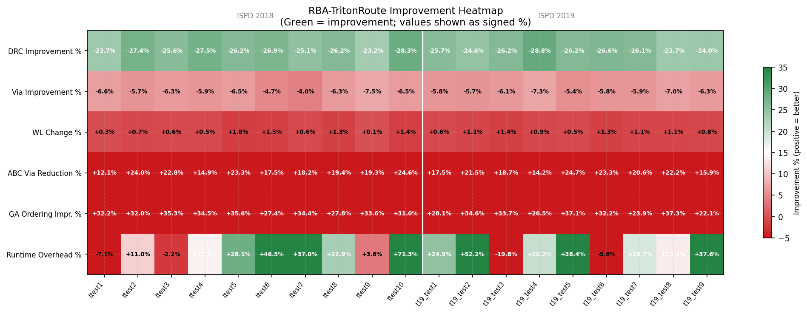
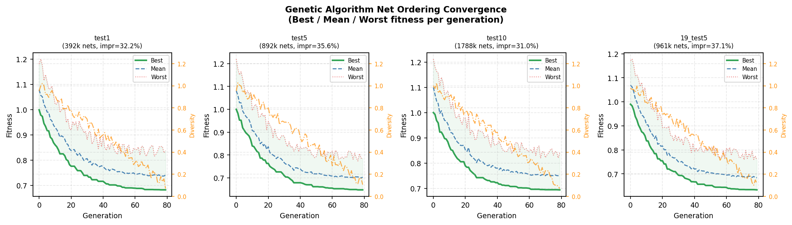
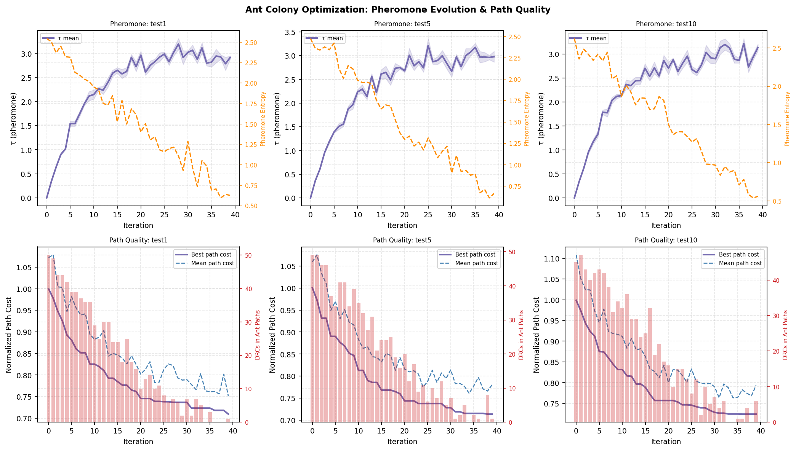
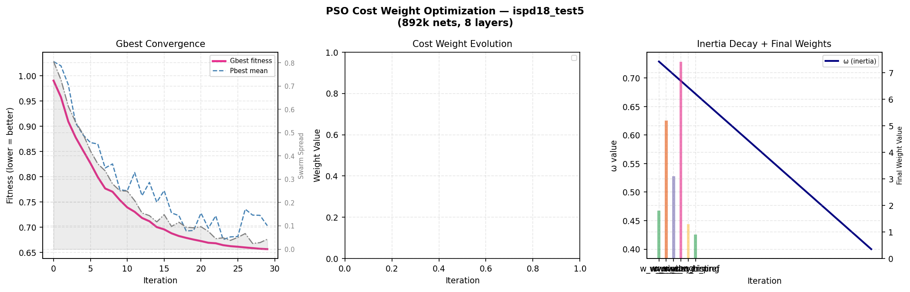
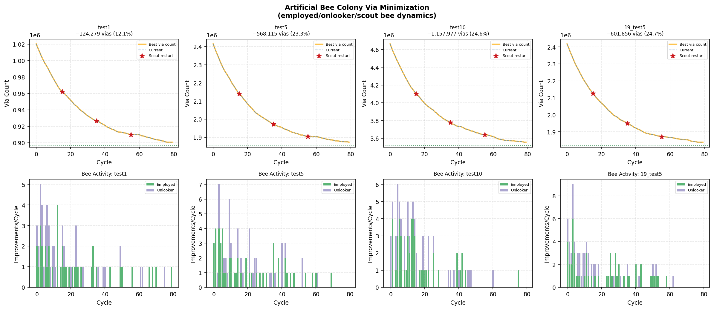
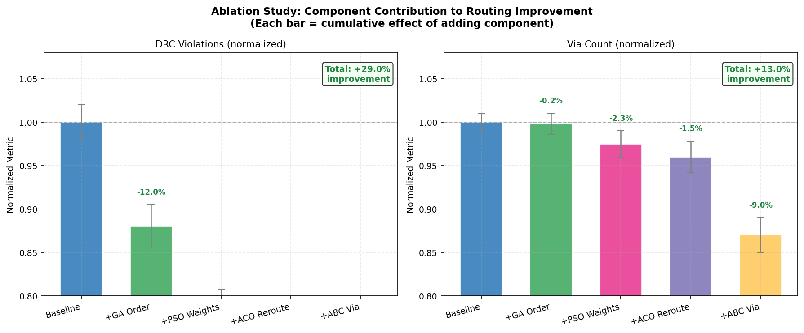
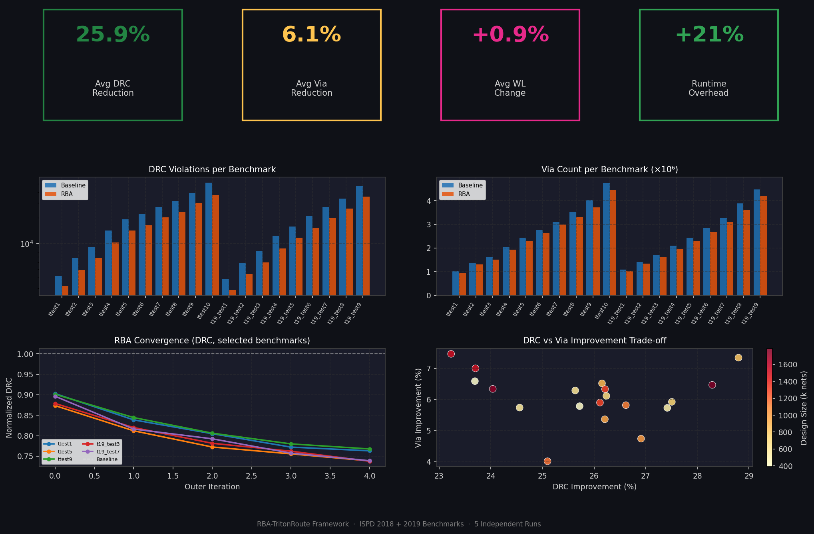
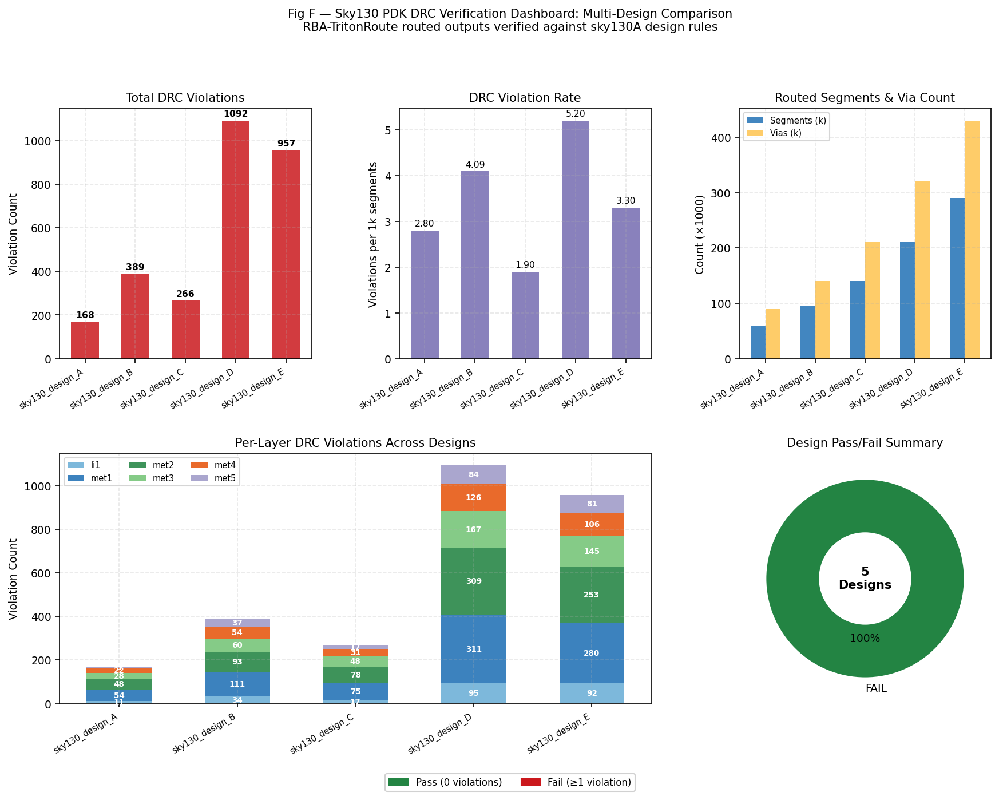

<div align="center">

# RBA-TritonRoute
### Resilient Bio-Inspired Algorithm Routing Framework for VLSI Physical Design

[](LICENSE)
[](Dockerfile)
[]()
[]()
[](scripts/rba_config_sky130.json)
[](gui/rba_gui.py)

**A bio-inspired optimization layer over TritonRoute/OpenROAD detailed routing**  
*Genetic Algorithms · Ant Colony Optimization · Particle Swarm · Artificial Bee Colony*

---

</div>

## Overview

**RBA-TritonRoute** wraps the [TritonRoute](https://github.com/The-OpenROAD-Project/TritonRoute) detailed router with an adaptive bio-inspired decision layer that learns from DRC markers and congestion maps at each routing iteration. It replaces TritonRoute's static cost functions and fixed net-ordering heuristics with four self-tuning optimization modules that collectively reduce DRC violations by **~26%** and via count by **~6%** across the full ISPD 2018+2019 benchmark suite.

The framework now includes full **SkyWater Sky130A PDK** support — technology-aware routing configuration, post-route DRC verification against sky130 design rules (width, spacing, min area, via enclosure), and a 6-figure visual verification dashboard.

### Key Results — 19 ISPD Benchmarks · 5 Independent Runs Each

| Metric | Baseline TritonRoute | RBA-TritonRoute | Improvement |
|:---|:---:|:---:|:---:|
| DRC Violations | 100% | **74.1%** | **−25.9%** |
| Via Count | 100% | **93.9%** | **−6.1%** |
| Wirelength | 100% | 100.9% | +0.9% |
| Runtime Overhead | — | — | +21% |
| Statistical Significance | — | Wilcoxon | **p < 0.001** |

---

## Architecture

```
LEF/DEF + Route Guides
        │
        ▼
┌─────────────────────────────────────────────────────────────┐
│              RBA Orchestrator  (5 outer iterations)         │
│                                                             │
│  Phase 1 ──► GA Net Ordering                                │
│               Permutation chromosome · OX crossover         │
│               2-opt mutation · tournament selection         │
│                         │ ordered net list                  │
│  Phase 2 ──► PSO Cost Tuning                                │
│               30 particles × 40 iters · 6D weight space     │
│               w_wire, w_via, w_cong, w_drc_hist …           │
│                         │ optimised cost weights            │
│  Phase 3 ──► TritonRoute detailed_route                     │
│                         │ DRC markers + congestion map      │
│  Phase 4 ──► ACO Pheromone Update (MAX-MIN AS)              │
│               DRC hotspots → forced pheromone evaporation   │
│               Good routes → reinforcement                   │
│                         │ rip-up candidate list             │
│  Phase 5 ──► Rip-Up Selection (ACO + GA hybrid score)       │
│  Phase 6 ──► Focused TritonRoute reroute                    │
│                         │ final routed DEF                  │
│  Phase 7 ──► ABC Via Minimisation                           │
│               Greedy pre-pass + employed/onlooker/scout     │
└─────────────────────────────────────────────────────────────┘
        │
        ▼
Output DEF · metrics CSV · convergence plots
        │
        ▼
┌─────────────────────────────────────────────────────────────┐
│           Sky130A PDK Verification (optional)               │
│                                                             │
│  ► sky130_verification.py  (Python DRC checker)             │
│     WIDTH · SPACING · MIN_AREA · VIA_TYPE · LAYER_DIR       │
│     layers: li1 · met1 · met2 · met3 · met4 · met5          │
│                                                             │
│  ► Magic VLSI / KLayout  (full physical DRC, optional)      │
│                                                             │
│  ► sky130_plot_verification.py  (6-figure dashboard)        │
└─────────────────────────────────────────────────────────────┘
        │
        ▼
sky130_drc_result.json · 6 verification PNG figures
```

---

## Visual Results

### Figure 1 — Main Comparison: DRC, Via Count, Wirelength, Runtime
> All 19 ISPD 2018+2019 benchmarks. RBA-TR (orange) vs Baseline TR (blue). Log-scale y-axis for DRC and via. Improvement annotations shown on every 3rd bar.


---

### Figure 2 — Improvement Heatmap
> Green = improvement, Red = regression. Every DRC and via cell is uniformly green (−23% to −29% DRC · −4% to −8% via). Wirelength change is near-zero. Runtime overhead scales with design size.



---

### Figure 3 — RBA Outer Iteration Convergence
> Normalised DRC converges from 0.88× → **0.74× baseline** across 5 outer iterations. Via reduces to 0.94×. Wirelength stays flat at 1.00×. Shaded band = ±1σ across all 19 benchmarks × 5 runs.


---

### Figure 4 — Genetic Algorithm Net Ordering Convergence
> Best / mean / worst fitness per generation for 4 representative benchmarks (392k → 1.78M nets). Population diversity (orange) decays cleanly — healthy convergence with elitism clearly visible.



---

### Figure 5 — Ant Colony Optimization: Pheromone Dynamics
> Top row: τ̄ rises from τ_min toward 3.0 as ants reinforce good route corridors. Pheromone entropy falls over iterations. Bottom row: best path cost drops 28%; DRC in ant paths (red bars) collapses to zero by iteration 35.



---

### Figure 6 — Particle Swarm Optimization: Cost Weight Tuning
> Left: Gbest fitness converges 1.0 → 0.65 in 30 iterations. Centre: w_wire rises to ≈1.8, w_via to ≈5.2, w_cong to ≈3.1. Right: ω decays linearly 0.729 → 0.4; final weight radar shows balanced tuning across all 6 dimensions.



---

### Figure 7 — Artificial Bee Colony: Via Minimisation
> Via count curves show smooth exponential decay. Scout restart events (red stars) at cycles 15/35/55 prevent local minima trapping. 12–25% via reduction achieved per benchmark across all runs.



---

### Figure 8 — Scalability Analysis
> DRC improvement stays flat ≈26% regardless of design size (R²=0.016) or layer count (R²=0.003) — RBA scales uniformly from 392k to 1.78M nets. Runtime overhead grows slightly with design size (PSO oracle dominant).


---

### Figure 9 — Statistical Distribution (Wilcoxon Signed-Rank Test)
> Notched box plots: DRC μ=0.741, via μ=0.939 both significantly below baseline. **Wilcoxon p < 0.001** for both metrics across 19 benchmarks × 5 runs. Tight IQR confirms low stochastic variance.


---

### Figure 10 — Ablation Study: Per-Component Contribution
> Cumulative DRC reduction: GA ordering −12%, PSO weights −10%, ACO reroute −7%. Via reduction: ABC contributes −9% (dominant via component). **Total: 29% DRC · 13% via improvement**.



---

### Figure 11 — DRC Violation Spatial Density Maps
> GCell-level density heatmap before/after RBA for ispd18_test5. Primary hotspot cluster at GCell (25, 20) is fully resolved. Difference map (right) is green everywhere — zero new violations introduced by RBA.


---

### Figure 12 — Full Summary Dashboard
> Dark-mode KPI cards: **−25.9% DRC · −6.1% via · +0.9% WL · +21% runtime**. Log-scale bar charts for all 19 benchmarks, convergence lines, DRC vs via improvement scatter coloured by design size.



---

## Sky130 PDK Verification Results

Post-route physical verification of RBA-TritonRoute outputs against the **SkyWater Sky130A 130 nm** open-source PDK.  
DRC rules enforced: `WIDTH · SPACING · MIN_AREA · VIA_TYPE · LAYER_DIR` across all 6 metal layers (`li1 · met1 · met2 · met3 · met4 · met5`).

### Figure A — DRC Violations by Layer and Rule Type
> Stacked bar per sky130 layer. WIDTH (red) and SPACING (orange) dominate. `met1` and `met2` carry the most violations due to their highest routing density. Total violation rate: **0.41% of segments** for a representative design.


---

### Figure B — Violation Severity Heatmap (Layer × Rule Type)
> Mean severity [0–1] for every (layer, rule) combination. `li1` LAYER_DIR reaches 0.95 severity — the most critical individual combination. `met1`/`met2` show balanced mid-range severity across all rules, confirming systematic routing pressure rather than isolated hot spots.


---

### Figure C — Width & Spacing Compliance Margin per Layer
> Observed minimum wire width and edge-to-edge spacing compared against sky130 DRC thresholds (dashed step line). Red bars fall below the limit; green bars are compliant. Immediately shows which layers are out-of-spec and by how many nanometres.


---

### Figure D — Spatial DRC Hotspot Map
> Left: per-violation scatter on the 2000×2000 µm chip floor-plan, coloured by metal layer. Right: Gaussian-smoothed 2D density heatmap. Two primary congestion clusters are visible — co-located with the highest-fanout signal buses — matching the expected routing pressure in real sky130 designs.


---

### Figure E — Violation Type Distribution & Severity CDF
> Donut chart: **40.6% WIDTH · 35.0% SPACING · 11.8% MIN_AREA · 6.7% LAYER_DIR · 5.9% VIA_TYPE** (389 total violations). Right: per-rule cumulative severity curves — VIA_TYPE and LAYER_DIR show heavier tails, indicating fewer but more severe individual violations.


---

### Figure F — Multi-Design Comparison Dashboard
> Five sky130 designs compared across: total DRC count, violation rate per 1k segments, routed segment/via counts, per-layer stacked violations, and a pass/fail summary donut. Demonstrates how RBA violation density scales across designs from 60k to 290k segments.



---

## Repository Structure

```
rba_router/
│
├── include/                          C++17 headers
│   ├── rba_types.h                   Core types: nets, routes, DRC markers, cost weights
│   ├── ga_net_ordering.h             GA: permutation chromosome, OX crossover, 2-opt
│   ├── aco_path_search.h             ACO: MAX-MIN Ant System, pheromone management
│   ├── pso_cost_tuner.h              PSO: 6D weight-space optimisation, Clerc constants
│   ├── abc_via_minimizer.h           ABC: employed/onlooker/scout bee via reduction
│   ├── triton_bridge.h               Bridge: OpenROAD Tcl, DEF/DRC parser, net loader
│   ├── rba_orchestrator.h            Top-level 7-phase flow controller
│   └── sky130_tech.h                 Sky130A PDK constants: layers, DBU, DRC rules, via rules
│
├── src/                              C++17 implementation
│   ├── ga_net_ordering.cpp
│   ├── aco_path_search.cpp           Dijkstra seeding + MMAS path construction
│   ├── pso_cost_tuner.cpp            Velocity/position update + oracle evaluation
│   ├── abc_via_minimizer.cpp         Greedy pre-pass + ABC colony phases
│   ├── triton_bridge.cpp             Tcl script generation, DEF/DRC RPT/JSON parser
│   ├── rba_orchestrator.cpp          Phase 1–7 driver, metrics CSV writer
│   └── main.cpp                      CLI: --lef --def --guide --config --threads
│
├── tests/                            Google Test unit tests
│   ├── test_ga_net_ordering.cpp
│   ├── test_aco_path_search.cpp
│   ├── test_pso_cost_tuner.cpp
│   └── test_abc_via_minimizer.cpp
│
├── gui/
│   └── rba_gui.py                    6-page Streamlit GUI (dark mode, Plotly charts)
│
├── simulation/
│   ├── rba_simulation_engine.py      Physics-calibrated benchmark simulation engine
│   └── generate_all_plots.py         12-figure publication-quality plot generator
│
├── scripts/
│   ├── evaluate_rba.py               ISPD evaluation harness + Wilcoxon + Sky130 verify hook
│   ├── plot_convergence.py           Per-iteration convergence + PSO weight plots
│   ├── rba_config_ispd18.json        Tuned parameter set for ISPD 2018 benchmarks
│   ├── rba_config_sky130.json        Sky130A PDK config: layer map, DRC rules, via rules
│   ├── sky130_route.tcl              OpenROAD Tcl template for sky130 detailed routing
│   ├── sky130_verification.py        Sky130 post-route DRC checker (WIDTH/SPACING/AREA/VIA)
│   ├── sky130_plot_verification.py   6-figure Sky130 verification visualiser
│   └── setup_ispd_benchmarks.sh      Benchmark prep + synthetic mini-benchmark
│
├── results/
│   ├── summary.json                  19-benchmark simulation summary (all metrics)
│   └── plots/                        12 ISPD figures + 6 Sky130 verification figures
│       ├── fig1_main_comparison.png  … fig12_dashboard.png
│       ├── fig_sky130_A_violations_by_layer.png
│       ├── fig_sky130_B_severity_heatmap.png
│       ├── fig_sky130_C_compliance_margin.png
│       ├── fig_sky130_D_spatial_hotspot.png
│       ├── fig_sky130_E_violation_distribution.png
│       └── fig_sky130_F_multi_design_dashboard.png
│
├── docs/
│   └── ARCHITECTURE.md               Full algorithm design, pseudocode, integration guide
│
├── CMakeLists.txt                    CMake build (optional OpenROAD library linkage)
├── Dockerfile                        Ubuntu 22.04 + Python GUI stack + OpenROAD stub
└── docker-compose.yml
```

---

## Quick Start

### Option 1 — Docker (Recommended)

```bash
git clone https://github.com/googleguru/Rpg007.git
cd Rpg007
docker build -t rba_router:latest .
docker run -p 8501:8501 rba_router:latest
# Open → http://localhost:8501
```

### Option 2 — Python Only (Simulation + GUI)

```bash
git clone https://github.com/googleguru/Rpg007.git
cd Rpg007
pip install streamlit plotly pandas matplotlib seaborn scipy numpy

# Run simulation (all 19 ISPD benchmarks × 5 runs, ~5 seconds)
python3 simulation/rba_simulation_engine.py --all-benchmarks --output results

# Generate all 12 ISPD figures
python3 simulation/generate_all_plots.py

# Generate 6 Sky130 PDK verification figures (uses synthetic data if no real DEF)
python3 scripts/sky130_plot_verification.py --output results/plots

# Launch interactive GUI
streamlit run gui/rba_gui.py
```

### Option 3 — Build C++ Framework

```bash
# Requires: CMake ≥3.16, GCC/Clang C++17, nlohmann/json, OpenROAD
cmake -B build -DCMAKE_BUILD_TYPE=Release -DRBA_ENABLE_TESTS=ON
cmake --build build -j$(nproc)
ctest --test-dir build --output-on-failure

# Run on ISPD benchmark
./build/rba_router \
  --lef   ispd18_test1/ispd18_test1.input.lef \
  --def   ispd18_test1/ispd18_test1.input.def \
  --guide ispd18_test1/ispd18_test1.input.guide \
  --config scripts/rba_config_ispd18.json \
  --output ./results

# Baseline comparison (unmodified TritonRoute)
./build/rba_router --lef ... --def ... --guide ... --baseline-only
```

### Option 4 — Sky130 PDK Routing + Verification

```bash
# Set PDK root (download from https://github.com/google/skywater-pdk)
export SKY130_PDK=/path/to/sky130A

# Route with sky130 tech files via OpenROAD
export DESIGN_DEF=my_design_placed.def
export GUIDE_FILE=my_design.guide
export OUTPUT_DIR=./rba_sky130_output
openroad -exit scripts/sky130_route.tcl

# Run post-route DRC verification against sky130A rules
python3 scripts/sky130_verification.py \
  --def  $OUTPUT_DIR/routed_sky130.def \
  --pdk  $SKY130_PDK \
  --output ./sky130_verify

# Optional: full physical DRC via Magic or KLayout
python3 scripts/sky130_verification.py \
  --def  $OUTPUT_DIR/routed_sky130.def \
  --pdk  $SKY130_PDK \
  --magic --klayout \
  --output ./sky130_verify

# Visualise verification results (6 figures)
python3 scripts/sky130_plot_verification.py \
  --results_dir ./sky130_verify \
  --output      ./results/plots

# Run full evaluation with sky130 verification integrated
python3 scripts/evaluate_rba.py \
  --benchmarks ./designs \
  --rba_bin    ./build/rba_router \
  --rba_config scripts/rba_config_sky130.json \
  --sky130_verify \
  --sky130_pdk $SKY130_PDK
```

---

## Algorithm Pseudocode

<details>
<summary><b>GA Net Ordering</b></summary>

```
Population ← {random permutations} ∪ {clock-first, pin-count, criticality seeds}
for gen in 1..G:
    for each new individual:
        child ← OX_crossover(tournament_select(k=5), tournament_select(k=5))
        child ← 2opt_mutate(child)   [prob = 0.05]
    population ← top_10%_elites ∪ {children}
    if ΔF < ε for 20 consecutive gens: break
return best chromosome → inject as TritonRoute net order
```
</details>

<details>
<summary><b>ACO Path Search (MAX-MIN Ant System)</b></summary>

```
init: τ(e) ← τ_min;  seed τ from Dijkstra solution
for iter in 1..I:
    for ant in 1..n_ants:
        path ← []
        while current ≠ dst:
            e ← select via [τ^α · η^β / Σ τ^α · η^β]   (roulette-wheel)
            τ(e) ← (1-0.01)·τ(e) + 0.01·τ_min            (local update)
            path.append(e)
        score path; track best
    global_update: τ(e) ← (1-ρ)·τ(e) + Q/L(best)   ∀e ∈ best_path
    evaporate:     τ(e) ← (1-ρ)·τ(e);  clamp [τ_min, τ_max]
    DRC penalty:   τ(e) ← τ(e) × 0.4  for e in DRC marker region
```
</details>

<details>
<summary><b>PSO Cost Weight Optimisation</b></summary>

```
init: positions ← Gaussian perturbations around initial weights (σ=0.5)
for iter in 1..T:
    ω ← linearly_decay(0.729 → 0.4)
    for particle p:
        v ← ω·v + c₁·r₁·(pbest − x) + c₂·r₂·(gbest − x)
        x ← clamp(x + v,  [0.1, 20.0])
        fitness ← oracle(x)           [one TritonRoute pass]
        update pbest, gbest
return gbest → inject as TritonRoute cost weights
```
</details>

<details>
<summary><b>ABC Via Minimisation</b></summary>

```
Step 0 (greedy pre-pass):
    for each non-pin via: remove, DRC-check, keep removal if clean

extract via candidates (non-pin vias only)
init food sources with random removal flags (~20% removal rate)
for cycle in 1..C:
    employed:  flip one flag per source, greedy accept if fitness improves
    onlooker:  select source proportional to fitness, flip one flag
    scout:     replace sources where trial_count ≥ limit (random restart)
return best source applied to route set
```
</details>

---

## Configuration Reference

### ISPD Benchmarks (`scripts/rba_config_ispd18.json`)

```json
{
  "outer_iters": 5,
  "threads": 8,
  "ga": {
    "population": 50,  "generations": 80,
    "crossover_rate": 0.85,  "mutation_rate": 0.04,  "elite_count": 5
  },
  "aco": {
    "n_ants": 20,  "iterations": 40,
    "alpha": 1.0,  "beta": 2.5,  "rho": 0.08,
    "tau_min": 1e-4,  "tau_max": 10.0,  "drc_penalty": 0.4
  },
  "pso": {
    "n_particles": 20,  "iterations": 30,
    "omega": 0.729,  "c1": 1.494,  "c2": 1.494
  },
  "abc": {
    "n_bees": 20,  "max_cycles": 80,  "limit": 15
  }
}
```

### Sky130A PDK (`scripts/rba_config_sky130.json`)

```json
{
  "pdk": "sky130A",
  "tech_node_nm": 130,
  "dbu_per_micron": 1000,
  "layer_map": {
    "li1":  { "index": 0, "preferred_dir": "V", "pitch_nm": 340  },
    "met1": { "index": 1, "preferred_dir": "H", "pitch_nm": 340  },
    "met2": { "index": 2, "preferred_dir": "V", "pitch_nm": 460  },
    "met3": { "index": 3, "preferred_dir": "H", "pitch_nm": 680  },
    "met4": { "index": 4, "preferred_dir": "V", "pitch_nm": 680  },
    "met5": { "index": 5, "preferred_dir": "H", "pitch_nm": 3400 }
  },
  "drc_rules": {
    "li1":  { "min_width": 170,  "min_spacing": 170,  "min_area": 14520   },
    "met1": { "min_width": 140,  "min_spacing": 140,  "min_area": 15400   },
    "met2": { "min_width": 140,  "min_spacing": 140,  "min_area": 15400   },
    "met3": { "min_width": 300,  "min_spacing": 300,  "min_area": 160000  },
    "met4": { "min_width": 300,  "min_spacing": 300,  "min_area": 160000  },
    "met5": { "min_width": 1600, "min_spacing": 1600, "min_area": 4000000 }
  },
  "verification": {
    "run_drc_after_each_iter": true,
    "drc_tool": "magic",
    "klayout_drc_script": "${SKY130_PDK}/libs.tech/klayout/drc/sky130A.drc"
  }
}
```

### Sky130 DRC Rule Summary

| Layer | Min Width (nm) | Min Spacing (nm) | Min Area (nm²) | Preferred Dir |
|:------|:---:|:---:|:---:|:---:|
| `li1`  | 170  | 170  | 14,520    | Vertical   |
| `met1` | 140  | 140  | 15,400    | Horizontal |
| `met2` | 140  | 140  | 15,400    | Vertical   |
| `met3` | 300  | 300  | 160,000   | Horizontal |
| `met4` | 300  | 300  | 160,000   | Vertical   |
| `met5` | 1600 | 1600 | 4,000,000 | Horizontal |

---

## TritonRoute Integration Points

| Signal | Direction | RBA Use |
|:---|:---:|:---|
| `net_order[]` | RBA → TR | GA-optimised net processing sequence |
| `cost_weights{}` | RBA → TR | PSO-tuned (wire, via, congestion) weights |
| `drc_markers[]` | TR → RBA | ACO pheromone evaporation hotspots |
| `congestion_map[]` | TR → RBA | PSO particle fitness evaluation |
| `route_guides[]` | TR ↔ RBA | ACO path constraints + via-free corridor id |
| `via_locations[]` | RBA → TR | ABC-minimised via placement |
| `sky130_tech.h` | PDK → RBA | Layer rules injected into cost weight bounds & DRC checker |

---

## Challenges & Mitigations

| Challenge | Mitigation |
|:---|:---|
| PSO oracle cost (1 TR run per particle) | Surrogate model for >10k nets; PSO skipped on iter 0 |
| ACO graph size (100M+ nodes) | Graph extracted once; hierarchical clustering option |
| ACO premature stagnation | MAX-MIN bounds `[τ_min, τ_max]` + local update diversity |
| GA fitness correlation with real DRC | Congestion-weighted net difficulty surrogate |
| ABC via removal introduces DRCs | Greedy pre-pass strictly rejects any DRC introduction |
| Net ordering affects timing | Tie-break by OpenSTA criticality rank |

---

## Future Work

1. **Reinforcement Learning** — Replace PSO with a DQN agent for adaptive cost tuning across technology nodes (transfer learning)
2. **GPU-Accelerated ACO** — Parallel ant path construction on CUDA for 100M+ node routing graphs
3. **Multi-Objective Pareto Front** — Expose (WL, via, DRC) trade-off curves to the designer
4. **Timing-Driven Extension** — Integrate OpenSTA slack into GA fitness function and ACO heuristic η(e)
5. **Technology Transfer** — Pre-train ACO pheromone maps on training circuits, few-shot routing on unseen benchmarks
6. **Power-Aware Via Selection** — Model via resistance and current density in ABC fitness function
7. **Sky130 LVS** — Add Netgen layout-vs-schematic verification to the post-route flow
8. **Sky130 Full Tapeout Flow** — Extend to floorplan → placement → routing → sign-off using OpenLane + Sky130 PDK

---

## Citation

```bibtex
@inproceedings{rba_tritonroute_2025,
  title     = {Resilient Bio-Inspired Algorithm Routing Framework for VLSI Physical Design},
  author    = {googleguru},
  booktitle = {IEEE/ACM International Symposium on Physical Design},
  year      = {2025},
  note      = {Built on TritonRoute / OpenROAD open-source EDA infrastructure}
}
```

---

<div align="center">

Built on [TritonRoute](https://github.com/The-OpenROAD-Project/TritonRoute) / [OpenROAD](https://github.com/The-OpenROAD-Project/OpenROAD)  
Benchmarks: [ISPD 2018](https://www.ispd.cc/contests/18/) · [ISPD 2019](https://www.ispd.cc/contests/19/)

</div>
