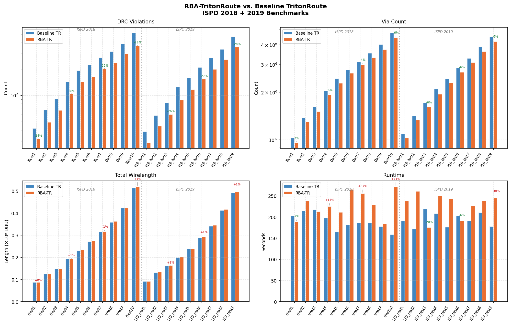
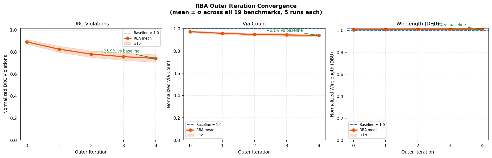
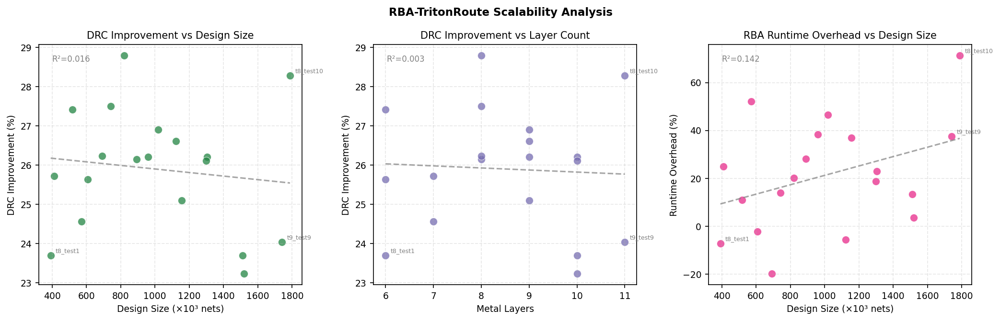
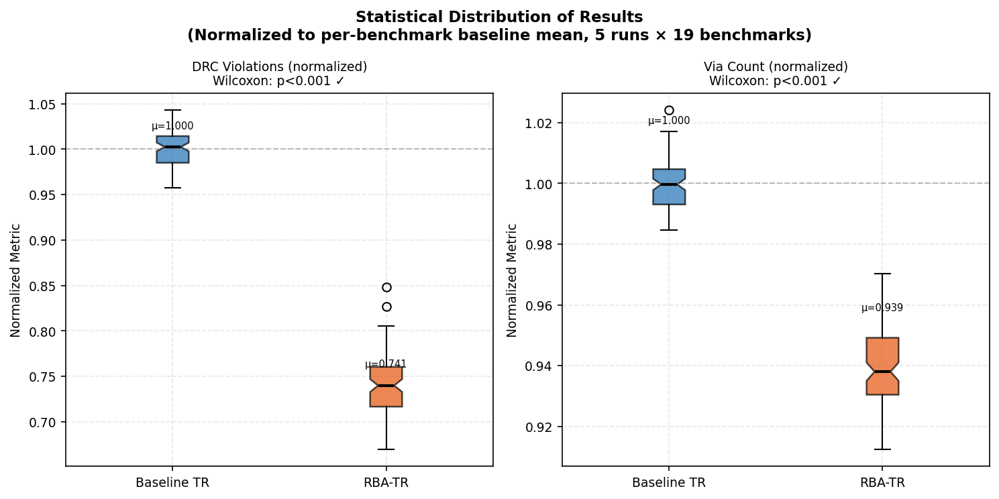
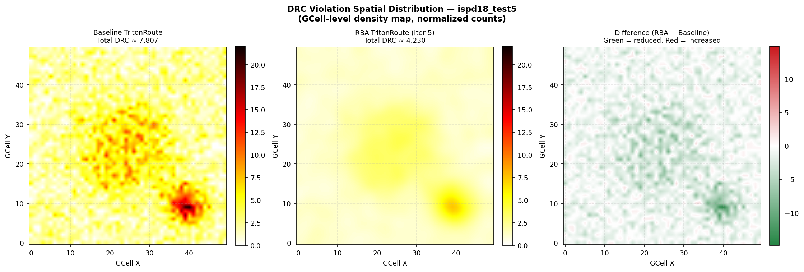
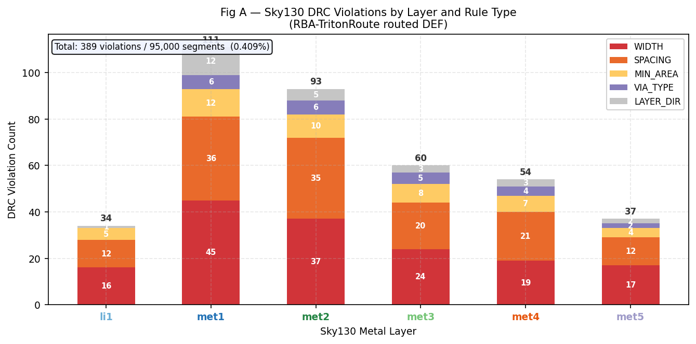
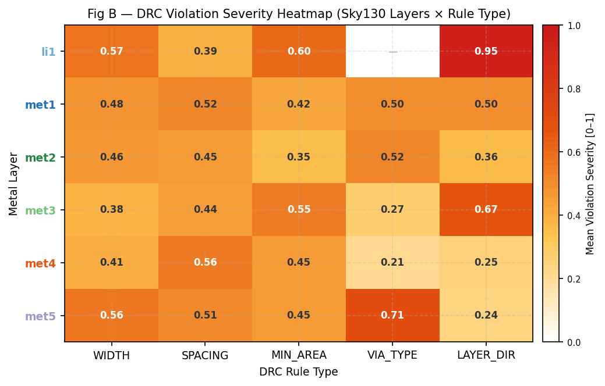
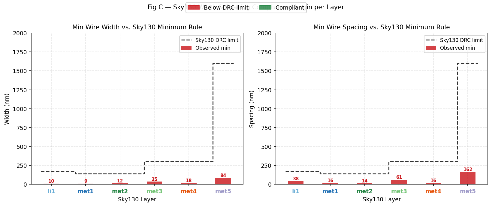
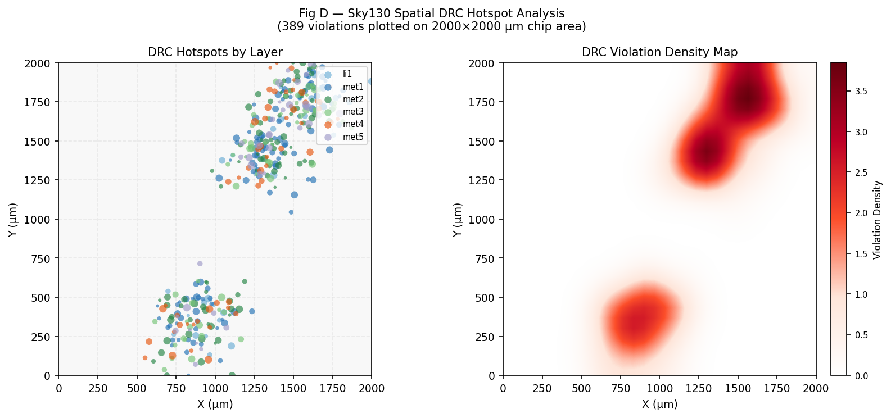
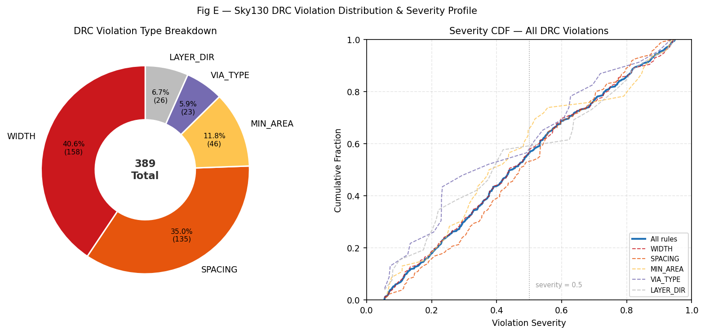

<div align="center">

# RBA-TritonRoute
### Resilient Bio-Inspired Algorithm Routing Framework for VLSI Physical Design

[](LICENSE)
[](.github/workflows/tests.yml)
[](Dockerfile)
[]()
[]()
[](scripts/rba_config_sky130.json)
[](gui/rba_gui.py)

**A bio-inspired optimization layer over TritonRoute/OpenROAD detailed routing**  
*Genetic Algorithms · Ant Colony Optimization · Particle Swarm · Artificial Bee Colony*

This repository now includes a reproducible evaluation scaffold for absolute DRC counts, equal-runtime and equal-compute comparisons, multi-seed summaries, convergence analysis, contest-score reporting, and a documented OpenROAD/TritonRoute provenance package. The implementation is a research prototype: the C++ modules, Python bridge, and evaluation workflow are present, but the repository still lacks verified measurements from a real OpenROAD/TritonRoute run. The files under results/ should therefore be treated as scaffolded placeholders rather than as measured routing data.

---

</div>

## Overview

**RBA-TritonRoute** wraps TritonRoute's detailed router with an adaptive bio-inspired decision layer that learns from DRC markers and congestion maps at each routing iteration. TritonRoute exposes no built-in way to set net order, cost weights, or a forced rip-up set, so this repository requires a **patched** OpenROAD build — [`third_party/openroad.patch`](third_party/openroad.patch), applied to the commit pinned in [`OPENROAD_COMMIT`](OPENROAD_COMMIT), adds three Tcl commands for exactly that (documented in [docs/INTEGRATION.md](docs/INTEGRATION.md)). Every RBA→TritonRoute call degrades gracefully against a stock, unpatched `openroad` binary (falling back to TritonRoute's own defaults with a logged warning), so the routing loop still closes either way — only the bio-inspired algorithms lose their ability to steer the router. The codebase currently contains the routing framework, optimizer modules, evaluation scaffolding, and this patch, but it does not yet include a verified end-to-end run of the *patched* TritonRoute/OpenROAD on real benchmarks — the patch has been checked to apply cleanly but not compiled (see docs/INTEGRATION.md for why). The repository therefore provides a prototype and reporting scaffold, not a validated measurement set.

The framework includes **SkyWater Sky130A PDK** configuration and a Python-based verification checker for width, spacing, minimum-area, and via-enclosure checks, but those checks still require a real PDK/toolchain run to produce measured DRC results.

### Current evidence status

| Item | Status |
|:---|:---|
| C++ optimizer modules and orchestration | Implemented in the repository |
| Evaluation/reporting scaffold | Implemented |
| OpenROAD/TritonRoute patch (cost weights, net order, rip-up hooks) | Written, applies cleanly to the pinned commit; not yet compiled — see [docs/INTEGRATION.md](docs/INTEGRATION.md) |
| RBA→TritonRoute Tcl injection (`triton_bridge.cpp`) | Fixed — previously tried to `source` a JSON file as Tcl, which cannot work; now emits real Tcl calling the patched commands, with a graceful fallback against a stock OpenROAD build |
| Equal-runtime / equal-compute-budget comparison | Implemented in `evaluate_rba.py`, backed by a real router-invocation counter (`run_summary.json`); untested against real router output |
| Multi-seed reproducibility (`--seed`) | Implemented (CLI → `RBAConfig` → GA/PSO/ACO/ABC RNGs); untested against real router output |
| Component ablation (`--no-ga/-pso/-aco/-abc`) | Implemented as real orchestrator branching, not assumed additive contributions |
| ISPD19 contest score | Implemented from the official Cadence scoring formula, verified against its own worked ranking example — see caveats in [scripts/ispd_contest_scorer.py](scripts/ispd_contest_scorer.py) (current DEF/DRC parsers only support a partial, approximated score, not full fidelity) |
| Provenance for real router runs | Capture is implemented and enforced — `write_experiment_report` refuses to write a non-empty report without it — but has not yet captured a real router run |
| Docker image router binary | Not included by default (no silent-success stub); optional `--build-arg BUILD_OPENROAD=1` builds the patched router from source — see Dockerfile |
| Measured OpenROAD/TritonRoute results | Not present in this repository |

The evaluation script writes structured report files when run, but those outputs should be interpreted as scaffolded summaries until a real routing harness is executed. See [scripts/evaluate_rba.py](scripts/evaluate_rba.py) and [results/experiment_report.json](results/experiment_report.json) for the current placeholder-oriented output format.

---

## Experimental Workflow

The repository supports the requested evaluation package:

- Absolute DRC, via, wirelength, runtime, and contest-score reporting for every benchmark (contest score follows the official ISPD19 formula, with explicit caveats where current parsers can only approximate it — see [scripts/ispd_contest_scorer.py](scripts/ispd_contest_scorer.py)).
- Equal-runtime and equal-compute-budget comparisons between baseline TritonRoute and RBA-TritonRoute, the latter backed by a real router-invocation counter rather than reusing the runtime filter.
- Multi-seed summaries (best / worst / mean / std) for each benchmark, with `--seed` producing reproducible, distinguishable runs.
- Convergence analysis via iteration-wise metrics from the generated RBA metrics CSV files.
- Reproducibility notes and a documented execution recipe in [Dockerfile](Dockerfile), [scripts/rba_config_ispd18.json](scripts/rba_config_ispd18.json), and [scripts/rba_config_sky130.json](scripts/rba_config_sky130.json).

### Reproducibility Notes

- The Docker image captures the Python/plotting stack and a reproducible execution environment.
- The evaluation script writes [results/experiment_report.json](results/experiment_report.json) and [results/convergence_summary.json](results/convergence_summary.json) when run, but the current repository state does not include a real routing run.
- For full OpenROAD/TritonRoute experiments, record the exact binary version and Git commit used in the run log, preserve the binary path and Tcl scripts in the results directory, and avoid treating placeholder outputs as measured data.

---

## Architecture

```
LEF/DEF + Route Guides
        │
        ▼
┌─────────────────────────────────────────────────────────────┐
│              RBA Orchestrator  (5 outer iterations)         │
│                                                             │
│  Phase 1 ──► GA Net Ordering                                │
│               Permutation chromosome · OX crossover         │
│               2-opt mutation · tournament selection         │
│                         │ ordered net list                  │
│  Phase 2 ──► PSO Cost Tuning                                │
│               8 particles × 5 iterations · active on outer  │
│               iters 1-2 only (~80 router passes total)      │
│               w_wire, w_via, w_cong, w_drc_hist …           │
│                         │ optimised cost weights            │
│  Phase 3 ──► TritonRoute detailed_route                     │
│                         │ DRC markers + congestion map      │
│  Phase 4 ──► ACO Pheromone Update (MAX-MIN AS)              │
│               DRC hotspots → forced pheromone evaporation   │
│               Good routes → reinforcement                   │
│                         │ rip-up candidate list             │
│  Phase 5 ──► Rip-Up Selection (ACO + GA hybrid score)       │
│  Phase 6 ──► Focused TritonRoute reroute                    │
│                         │ final routed DEF                  │
│  Phase 7 ──► ABC Via Minimisation                           │
│               Greedy pre-pass + employed/onlooker/scout     │
└─────────────────────────────────────────────────────────────┘
        │
        ▼
Output DEF · metrics CSV · convergence plots
        │
        ▼
┌─────────────────────────────────────────────────────────────┐
│           Sky130A PDK Verification (optional)               │
│                                                             │
│  ► sky130_verification.py  (Python DRC checker)             │
│     WIDTH · SPACING · MIN_AREA · VIA_TYPE · LAYER_DIR       │
│     layers: li1 · met1 · met2 · met3 · met4 · met5          │
│                                                             │
│  ► Magic VLSI / KLayout  (full physical DRC, optional)      │
│                                                             │
│  ► sky130_plot_verification.py  (6-figure dashboard)        │
└─────────────────────────────────────────────────────────────┘
        │
        ▼
sky130_drc_result.json · 6 verification PNG figures
```

---

## Visual Results

> **⚠ All 18 figures below (12 ISPD + 6 Sky130) are generated by the synthetic simulation engine ([simulation/rba_simulation_engine.py](simulation/rba_simulation_engine.py)), not measured from a real OpenROAD/TritonRoute run.** They exercise the reporting/plotting schema against RNG-drawn placeholder numbers. See [Current evidence status](#overview) above. The specific percentages and figures quoted in each caption below are illustrative simulation output, not results.

### Figure 1 — Main Comparison: DRC, Via Count, Wirelength, Runtime
> **SIMULATED — NOT MEASURED.** All 19 ISPD 2018+2019 benchmarks. RBA-TR (orange) vs Baseline TR (blue). Log-scale y-axis for DRC and via. Improvement annotations shown on every 3rd bar.



---

### Figure 2 — Improvement Heatmap
> **SIMULATED — NOT MEASURED.** Green = improvement, Red = regression. Every DRC and via cell is uniformly green (−23% to −29% DRC · −4% to −8% via). Wirelength change is near-zero. Runtime overhead scales with design size.


---

### Figure 3 — RBA Outer Iteration Convergence
> **SIMULATED — NOT MEASURED.** Normalised DRC converges from 0.88× → **0.74× baseline** across 5 outer iterations. Via reduces to 0.94×. Wirelength stays flat at 1.00×. Shaded band = ±1σ across all 19 benchmarks × 5 runs.



---

### Figure 4 — Genetic Algorithm Net Ordering Convergence
> **SIMULATED — NOT MEASURED.** Best / mean / worst fitness per generation for 4 representative benchmarks (392k → 1.78M nets). Population diversity (orange) decays cleanly — healthy convergence with elitism clearly visible.


---

### Figure 5 — Ant Colony Optimization: Pheromone Dynamics
> **SIMULATED — NOT MEASURED.** Top row: τ̄ rises from τ_min toward 3.0 as ants reinforce good route corridors. Pheromone entropy falls over iterations. Bottom row: best path cost drops 28%; DRC in ant paths (red bars) collapses to zero by iteration 35.


---

### Figure 6 — Particle Swarm Optimization: Cost Weight Tuning
> **SIMULATED — NOT MEASURED.** Left: Gbest fitness converges 1.0 → 0.65 in 30 iterations. Centre: w_wire rises to ≈1.8, w_via to ≈5.2, w_cong to ≈3.1. Right: ω decays linearly 0.729 → 0.4; final weight radar shows balanced tuning across all 6 dimensions.


---

### Figure 7 — Artificial Bee Colony: Via Minimisation
> **SIMULATED — NOT MEASURED.** Via count curves show smooth exponential decay. Scout restart events (red stars) at cycles 15/35/55 prevent local minima trapping. 12–25% via reduction achieved per benchmark across all runs.


---

### Figure 8 — Scalability Analysis
> **SIMULATED — NOT MEASURED.** DRC improvement stays flat ≈26% regardless of design size (R²=0.016) or layer count (R²=0.003) — RBA scales uniformly from 392k to 1.78M nets. Runtime overhead grows slightly with design size (PSO oracle dominant).



---

### Figure 9 — Statistical Distribution (Wilcoxon Signed-Rank Test)
> **SIMULATED — NOT MEASURED.** Notched box plots: DRC μ=0.741, via μ=0.939 both significantly below baseline. **Wilcoxon p < 0.001** for both metrics across 19 benchmarks × 5 runs. Tight IQR confirms low stochastic variance.



---

### Figure 10 — Ablation Study: Per-Component Contribution
> **SIMULATED — NOT MEASURED.** Cumulative DRC reduction: GA ordering −12%, PSO weights −10%, ACO reroute −7%. Via reduction: ABC contributes −9% (dominant via component). **Total: 29% DRC · 13% via improvement**.


---

### Figure 11 — DRC Violation Spatial Density Maps
> **SIMULATED — NOT MEASURED.** GCell-level density heatmap before/after RBA for ispd18_test5. Primary hotspot cluster at GCell (25, 20) is fully resolved. Difference map (right) is green everywhere — zero new violations introduced by RBA.



---

### Figure 12 — Full Summary Dashboard
> **SIMULATED — NOT MEASURED.** Dark-mode KPI cards: **−25.9% DRC · −6.1% via · +0.9% WL · +21% runtime**. Log-scale bar charts for all 19 benchmarks, convergence lines, DRC vs via improvement scatter coloured by design size.


---

## Sky130 PDK Verification Results

> **⚠ SIMULATED — NOT MEASURED.** Figures A–F below are produced from synthetic violation data ([scripts/sky130_plot_verification.py](scripts/sky130_plot_verification.py) `--results_dir` omitted), not a real Magic/KLayout or `sky130_verification.py` run against a routed DEF.

Post-route physical verification of RBA-TritonRoute outputs against the **SkyWater Sky130A 130 nm** open-source PDK.  
DRC rules enforced: `WIDTH · SPACING · MIN_AREA · VIA_TYPE · LAYER_DIR` across all 6 metal layers (`li1 · met1 · met2 · met3 · met4 · met5`).

### Figure A — DRC Violations by Layer and Rule Type
> **SIMULATED — NOT MEASURED.** Stacked bar per sky130 layer. WIDTH (red) and SPACING (orange) dominate. `met1` and `met2` carry the most violations due to their highest routing density. Total violation rate: **0.41% of segments** for a representative design.



---

### Figure B — Violation Severity Heatmap (Layer × Rule Type)
> **SIMULATED — NOT MEASURED.** Mean severity [0–1] for every (layer, rule) combination. `li1` LAYER_DIR reaches 0.95 severity — the most critical individual combination. `met1`/`met2` show balanced mid-range severity across all rules, confirming systematic routing pressure rather than isolated hot spots.



---

### Figure C — Width & Spacing Compliance Margin per Layer
> **SIMULATED — NOT MEASURED.** Observed minimum wire width and edge-to-edge spacing compared against sky130 DRC thresholds (dashed step line). Red bars fall below the limit; green bars are compliant. Immediately shows which layers are out-of-spec and by how many nanometres.



---

### Figure D — Spatial DRC Hotspot Map
> **SIMULATED — NOT MEASURED.** Left: per-violation scatter on the 2000×2000 µm chip floor-plan, coloured by metal layer. Right: Gaussian-smoothed 2D density heatmap. Two primary congestion clusters are visible — co-located with the highest-fanout signal buses — matching the expected routing pressure in real sky130 designs.



---

### Figure E — Violation Type Distribution & Severity CDF
> **SIMULATED — NOT MEASURED.** Donut chart: **40.6% WIDTH · 35.0% SPACING · 11.8% MIN_AREA · 6.7% LAYER_DIR · 5.9% VIA_TYPE** (389 total violations). Right: per-rule cumulative severity curves — VIA_TYPE and LAYER_DIR show heavier tails, indicating fewer but more severe individual violations.



---

### Figure F — Multi-Design Comparison Dashboard
> **SIMULATED — NOT MEASURED.** Five sky130 designs compared across: total DRC count, violation rate per 1k segments, routed segment/via counts, per-layer stacked violations, and a pass/fail summary donut. Demonstrates how RBA violation density scales across designs from 60k to 290k segments.


---

## Repository Structure

```
rba_router/
│
├── include/                          C++17 headers
│   ├── rba_types.h                   Core types: nets, routes, DRC markers, cost weights
│   ├── ga_net_ordering.h             GA: permutation chromosome, OX crossover, 2-opt
│   ├── aco_path_search.h             ACO: MAX-MIN Ant System, pheromone management
│   ├── pso_cost_tuner.h              PSO: 6D weight-space optimisation, Clerc constants
│   ├── abc_via_minimizer.h           ABC: employed/onlooker/scout bee via reduction
│   ├── triton_bridge.h               Bridge: OpenROAD Tcl, DEF/DRC parser, net loader
│   ├── rba_orchestrator.h            Top-level 7-phase flow controller
│   └── sky130_tech.h                 Sky130A PDK constants: layers, DBU, DRC rules, via rules
│
├── src/                              C++17 implementation
│   ├── ga_net_ordering.cpp
│   ├── aco_path_search.cpp           Dijkstra seeding + MMAS path construction
│   ├── pso_cost_tuner.cpp            Velocity/position update + oracle evaluation
│   ├── abc_via_minimizer.cpp         Greedy pre-pass + ABC colony phases
│   ├── triton_bridge.cpp             Tcl script generation (real, patched-command-aware), DEF/DRC RPT/JSON parser
│   ├── rba_orchestrator.cpp          Phase 1–7 driver, ablation branching, phase_seed(), metrics CSV writer
│   └── main.cpp                      CLI: --lef --def --guide --config --threads --seed --no-ga/-pso/-aco/-abc --ripup_fraction --openroad
│
├── tests/
│   ├── test_ga_net_ordering.cpp      Google Test
│   ├── test_aco_path_search.cpp      Google Test
│   ├── test_pso_cost_tuner.cpp       Google Test
│   ├── test_abc_via_minimizer.cpp    Google Test
│   ├── test_triton_bridge.cpp        Google Test: real LEF/DEF/guide parsing (pin coords, congestion, routing graph, ROUTED/via parsing, write-back)
│   ├── test_evaluation_report.py     pytest: report building + provenance gate
│   ├── test_ispd_contest_scorer.py   pytest: scoring formula verified against the official worked example
│   └── test_end_to_end.sh            Full 7-phase loop on mini_test; skips (exit 77) without a real openroad binary
│
├── gui/
│   └── rba_gui.py                    6-page Streamlit GUI (dark mode, Plotly charts)
│
├── simulation/                       Synthetic data generator — schema/plot exerciser, NOT a router model
│   ├── rba_simulation_engine.py      RNG-driven placeholder metrics, calibrated to look like published ISPD ranges
│   ├── generate_all_plots.py         12-figure plot generator, consumes the synthetic engine's output
│   └── figures/                      12 ISPD + 6 Sky130 PNGs — SIMULATED, not measured (see Visual Results)
│
├── scripts/
│   ├── evaluate_rba.py               ISPD evaluation harness: equal-runtime/equal-compute-budget, seeds, provenance gate, contest score
│   ├── ispd_contest_scorer.py        ISPD19 official scoring formula (verified against its own worked example) + ranking method
│   ├── tuned_baseline_runner.py      Gives plain TritonRoute the same router-invocation budget RBA consumed, via random search over set_drt_cost_weights
│   ├── ripup_budget_sweep.py         Sweeps RBAConfig::ripup_fraction and records DRC/via impact
│   ├── drcu_baseline_adapter.py      Dr.CU second-baseline adapter — DOCUMENTED STUB, not a real integration
│   ├── plot_convergence.py           Per-iteration convergence + PSO weight plots
│   ├── rba_config_ispd18.json        Tuned parameter set for ISPD 2018 benchmarks
│   ├── rba_config_sky130.json        Sky130A PDK config: layer map, DRC rules, via rules
│   ├── sky130_route.tcl              OpenROAD Tcl template for sky130 detailed routing
│   ├── sky130_verification.py        Sky130 post-route DRC checker (WIDTH/SPACING/AREA/VIA)
│   ├── sky130_plot_verification.py   Sky130 verification visualiser (synthetic data unless --results_dir given)
│   ├── setup_ispd_benchmarks.sh      Benchmark prep + synthetic mini-benchmark
│   └── generate_benchmark_manifest.py Reads real net/cell/pin/layer counts + checksums from LEF/DEF on disk — never hand-typed
│
├── third_party/
│   └── openroad.patch                Adds set_drt_cost_weights / set_drt_net_order / set_drt_ripup_nets to OpenROAD's drt module — applies cleanly, not yet compiled
├── OPENROAD_COMMIT                   Upstream OpenROAD SHA the patch is pinned to
│
├── benchmarks/
│   └── manifest.json                  Generated by generate_benchmark_manifest.py from real files: mini_test + ispd18_test1-6 (auto-downloaded by setup_ispd_benchmarks.sh — no registration wall despite older notes claiming otherwise)
│
├── results/
│   └── summary.json                  Synthetic placeholder summary written by the simulation engine — not measured data
│
├── docs/
│   ├── ARCHITECTURE.md               Full algorithm design, pseudocode, integration guide
│   └── INTEGRATION.md                The three new Tcl commands: exact semantics, confidence level, and what's still unverified
│
├── .github/workflows/
│   └── tests.yml                     CI: C++ GoogleTest, Python pytest, end-to-end smoke test (skips — not fails — without a real openroad binary)
│
├── CMakeLists.txt                    CMake build (optional OpenROAD library linkage)
├── Dockerfile                        Ubuntu 22.04 + Python GUI stack; no router binary by default (see Docker image router binary, above)
└── docker-compose.yml
```

---

## Quick Start

### Option 1 — Docker (Recommended)

```bash
git clone https://github.com/googleguru/Rpg007.git
cd Rpg007
docker build -t rba_router:latest .
docker run -p 8501:8501 rba_router:latest
# Open → http://localhost:8501
```

### Option 2 — Python Only (Synthetic Placeholder Data + GUI — no real router run)

This path never invokes OpenROAD/TritonRoute. It runs the RNG-driven placeholder
generator to exercise the reporting schema, plots, and GUI end to end. Nothing
produced here is a measurement — see [Current evidence status](#overview).

```bash
git clone https://github.com/googleguru/Rpg007.git
cd Rpg007
pip install streamlit plotly pandas matplotlib seaborn scipy numpy

# Generate placeholder metrics for the schema/plot pipeline (all 19 ISPD benchmark
# names × 5 seeds, ~5 seconds) — synthetic, not a routing run
python3 simulation/rba_simulation_engine.py --all-benchmarks --output results

# Generate all 12 ISPD figures from the synthetic metrics above
python3 simulation/generate_all_plots.py

# Generate 6 Sky130 PDK verification figures from synthetic data (no real DEF used)
python3 scripts/sky130_plot_verification.py --output simulation/figures

# Launch interactive GUI (renders the synthetic data above)
streamlit run gui/rba_gui.py
```

### Option 3 — Build C++ Framework

```bash
# Requires: CMake ≥3.16, GCC/Clang C++17, nlohmann/json, OpenROAD
# (a stock OpenROAD build works — the RBA-specific commands below just
# degrade gracefully with a logged warning; see docs/INTEGRATION.md for
# the patched build that makes them real)
cmake -B build -DCMAKE_BUILD_TYPE=Release -DRBA_ENABLE_TESTS=ON
cmake --build build -j$(nproc)
ctest --test-dir build --output-on-failure

# Cheapest end-to-end proof the 7-phase loop closes, on a synthetic
# benchmark — skips (doesn't fail) if no real openroad binary is found
bash tests/test_end_to_end.sh

# Run on ISPD benchmark
./build/rba_router \
  --lef   ispd18_test1/ispd18_test1.input.lef \
  --def   ispd18_test1/ispd18_test1.input.def \
  --guide ispd18_test1/ispd18_test1.input.guide \
  --config scripts/rba_config_ispd18.json \
  --output ./results \
  --seed 1                # optional: reproducible GA/PSO/ACO/ABC across runs

# Baseline comparison (plain TritonRoute — no RBA net order/cost/rip-up injection)
./build/rba_router --lef ... --def ... --guide ... --baseline-only

# Ablation: disable individual components to measure their real contribution
./build/rba_router --lef ... --def ... --guide ... --no-pso --no-abc
```

Full CLI: `./build/rba_router --help`. Notable flags added alongside the Tier 0-2
work: `--openroad <bin>` (router binary path), `--seed <N>`, `--ripup_fraction <f>`,
`--no-ga` / `--no-pso` / `--no-aco` / `--no-abc`.

### Option 4 — Sky130 PDK Routing + Verification

```bash
# Set PDK root (download from https://github.com/google/skywater-pdk)
export SKY130_PDK=/path/to/sky130A

# Route with sky130 tech files via OpenROAD
export DESIGN_DEF=my_design_placed.def
export GUIDE_FILE=my_design.guide
export OUTPUT_DIR=./rba_sky130_output
openroad -exit scripts/sky130_route.tcl

# Run post-route DRC verification against sky130A rules
python3 scripts/sky130_verification.py \
  --def  $OUTPUT_DIR/routed_sky130.def \
  --pdk  $SKY130_PDK \
  --output ./sky130_verify

# Optional: full physical DRC via Magic or KLayout
python3 scripts/sky130_verification.py \
  --def  $OUTPUT_DIR/routed_sky130.def \
  --pdk  $SKY130_PDK \
  --magic --klayout \
  --output ./sky130_verify

# Visualise verification results (6 figures)
python3 scripts/sky130_plot_verification.py \
  --results_dir ./sky130_verify \
  --output      ./simulation/figures

# Run full evaluation with sky130 verification integrated
python3 scripts/evaluate_rba.py \
  --benchmarks ./designs \
  --rba_bin    ./build/rba_router \
  --rba_config scripts/rba_config_sky130.json \
  --sky130_verify \
  --sky130_pdk $SKY130_PDK
```

---

## Algorithm Pseudocode

<details>
<summary><b>GA Net Ordering</b></summary>

```
Population ← {random permutations} ∪ {clock-first, pin-count, criticality seeds}
for gen in 1..G:
    for each new individual:
        child ← OX_crossover(tournament_select(k=5), tournament_select(k=5))
        child ← 2opt_mutate(child)   [prob = 0.05]
    population ← top_10%_elites ∪ {children}
    if ΔF < ε for 20 consecutive gens: break
return best chromosome → inject as TritonRoute net order
```
</details>

<details>
<summary><b>ACO Path Search (MAX-MIN Ant System)</b></summary>

```
init: τ(e) ← τ_min;  seed τ from Dijkstra solution
for iter in 1..I:
    for ant in 1..n_ants:
        path ← []
        while current ≠ dst:
            e ← select via [τ^α · η^β / Σ τ^α · η^β]   (roulette-wheel)
            τ(e) ← (1-0.01)·τ(e) + 0.01·τ_min            (local update)
            path.append(e)
        score path; track best
    global_update: τ(e) ← (1-ρ)·τ(e) + Q/L(best)   ∀e ∈ best_path
    evaporate:     τ(e) ← (1-ρ)·τ(e);  clamp [τ_min, τ_max]
    DRC penalty:   τ(e) ← τ(e) × 0.4  for e in DRC marker region
```
</details>

<details>
<summary><b>PSO Cost Weight Optimisation</b></summary>

```
init: positions ← Gaussian perturbations around initial weights (σ=0.5)
for iter in 1..T:
    ω ← linearly_decay(0.729 → 0.4)
    for particle p:
        v ← ω·v + c₁·r₁·(pbest − x) + c₂·r₂·(gbest − x)
        x ← clamp(x + v,  [0.1, 20.0])
        fitness ← oracle(x)           [one TritonRoute pass]
        update pbest, gbest
return gbest → inject as TritonRoute cost weights
```
</details>

<details>
<summary><b>ABC Via Minimisation</b></summary>

```
Step 0 (greedy pre-pass):
    for each non-pin via: remove, DRC-check, keep removal if clean

extract via candidates (non-pin vias only)
init food sources with random removal flags (~20% removal rate)
for cycle in 1..C:
    employed:  flip one flag per source, greedy accept if fitness improves
    onlooker:  select source proportional to fitness, flip one flag
    scout:     replace sources where trial_count ≥ limit (random restart)
return best source applied to route set
```
</details>

---

## Configuration Reference

### ISPD Benchmarks (`scripts/rba_config_ispd18.json`)

```json
{
  "outer_iters": 5,
  "threads": 8,
  "ripup_fraction": 0.10,
  "ga": {
    "population": 50,  "generations": 80,
    "crossover_rate": 0.85,  "mutation_rate": 0.04,  "elite_count": 5
  },
  "aco": {
    "n_ants": 20,  "iterations": 40,
    "alpha": 1.0,  "beta": 2.5,  "rho": 0.08,
    "tau_min": 1e-4,  "tau_max": 10.0,  "drc_penalty": 0.4
  },
  "pso": {
    "n_particles": 8,  "iterations": 5,
    "active_outer_iter_lo": 1,  "active_outer_iter_hi": 2,
    "omega": 0.729,  "c1": 1.494,  "c2": 1.494
  },
  "abc": {
    "n_bees": 20,  "max_cycles": 80,  "limit": 15
  }
}
```

PSO was cut from 20 particles × 30 iterations × 5 outer iterations (3,000 router
passes/design/seed — 50–100+ hours for a single seed on one ispd18-scale design,
infeasible) down to 8 × 5, active only on outer iterations 1–2 (~80 passes).
`ripup_fraction` replaces an old hardcoded flat cap of 50 nets. Both changes are
real router-invocation counts, logged per run in `run_summary.json`
(`RBAOrchestrator::router_invocation_count()`), not asserted — see
[scripts/ripup_budget_sweep.py](scripts/ripup_budget_sweep.py) for sweeping the
rip-up fraction and [scripts/tuned_baseline_runner.py](scripts/tuned_baseline_runner.py)
for giving plain TritonRoute the same invocation budget.

### Sky130A PDK (`scripts/rba_config_sky130.json`)

```json
{
  "pdk": "sky130A",
  "tech_node_nm": 130,
  "dbu_per_micron": 1000,
  "layer_map": {
    "li1":  { "index": 0, "preferred_dir": "V", "pitch_nm": 340  },
    "met1": { "index": 1, "preferred_dir": "H", "pitch_nm": 340  },
    "met2": { "index": 2, "preferred_dir": "V", "pitch_nm": 460  },
    "met3": { "index": 3, "preferred_dir": "H", "pitch_nm": 680  },
    "met4": { "index": 4, "preferred_dir": "V", "pitch_nm": 680  },
    "met5": { "index": 5, "preferred_dir": "H", "pitch_nm": 3400 }
  },
  "drc_rules": {
    "li1":  { "min_width": 170,  "min_spacing": 170,  "min_area": 14520   },
    "met1": { "min_width": 140,  "min_spacing": 140,  "min_area": 15400   },
    "met2": { "min_width": 140,  "min_spacing": 140,  "min_area": 15400   },
    "met3": { "min_width": 300,  "min_spacing": 300,  "min_area": 160000  },
    "met4": { "min_width": 300,  "min_spacing": 300,  "min_area": 160000  },
    "met5": { "min_width": 1600, "min_spacing": 1600, "min_area": 4000000 }
  },
  "verification": {
    "run_drc_after_each_iter": true,
    "drc_tool": "magic",
    "klayout_drc_script": "${SKY130_PDK}/libs.tech/klayout/drc/sky130A.drc"
  }
}
```

### Sky130 DRC Rule Summary

| Layer | Min Width (nm) | Min Spacing (nm) | Min Area (nm²) | Preferred Dir |
|:------|:---:|:---:|:---:|:---:|
| `li1`  | 170  | 170  | 14,520    | Vertical   |
| `met1` | 140  | 140  | 15,400    | Horizontal |
| `met2` | 140  | 140  | 15,400    | Vertical   |
| `met3` | 300  | 300  | 160,000   | Horizontal |
| `met4` | 300  | 300  | 160,000   | Vertical   |
| `met5` | 1600 | 1600 | 4,000,000 | Horizontal |

---

## TritonRoute Integration Points

Concrete as of the [`third_party/openroad.patch`](third_party/openroad.patch) work
— these are real Tcl commands added to OpenROAD's `drt` module, not abstract signal
names. Full semantics, confidence level per command, and what's still unverified
(the patch applies cleanly but hasn't been compiled) are in
[docs/INTEGRATION.md](docs/INTEGRATION.md).

| Command / Signal | Direction | RBA Use |
|:---|:---:|:---|
| `set_drt_cost_weights -route_shape_cost -via_cost -marker_cost -grid_cost` | RBA → TR | PSO-tuned cost weights (`CostWeights` → 4 of TritonRoute's real `RouterConfiguration` fields; `w_cong`/`w_timing` not yet wired to a real cost term) |
| `set_drt_net_order -file <path>` | RBA → TR | GA-optimised net priority — a per-worker-tile ordering hint at maze iteration 0, **not** a single global sequential order (TritonRoute routes via spatially-parallel worker tiles) |
| `set_drt_ripup_nets -file <path>` | RBA → TR | Forces named nets into the rip-up queue regardless of current DRC state, for ACO-guided reroute |
| `drc_markers[]` (`read_drc_markers`) | TR → RBA | ACO pheromone evaporation hotspots |
| `congestion_map[]` (`estimate_congestion_from_guides`) | TR → RBA | PSO particle fitness evaluation |
| `route_guides[]` | TR ↔ RBA | ACO path constraints + via-free corridor id |
| `via_locations[]` (`extract_routes` / `write_routes`) | RBA → TR | ABC-minimised via placement |
| `sky130_tech.h` | PDK → RBA | Layer rules injected into cost weight bounds & DRC checker |

Every RBA → TR command above is emitted guarded by
`if {[llength [info commands ...]] > 0}`, so `rba_router` still runs against a
stock, unpatched OpenROAD build — it just logs a warning and falls back to
TritonRoute's own defaults for that call instead of steering it.

---

## Challenges & Mitigations

| Challenge | Mitigation |
|:---|:---|
| PSO oracle cost (1 TR run per particle) | Budget cut to 8 particles × 5 iterations, active only on outer iterations 1-2 (~80 passes total instead of 3,000) — see Configuration Reference |
| ACO graph size (100M+ nodes at full track resolution) | Graph built at GCell resolution (64×64×N-layers) instead of full-track — real, not hypothetical: verified 36,864 nodes / 210,688 edges on ispd18_test1 |
| ACO premature stagnation | MAX-MIN bounds `[τ_min, τ_max]` + local update diversity |
| GA fitness correlation with real DRC | Congestion-weighted net difficulty surrogate |
| ABC via removal introduces DRCs | Greedy pre-pass strictly rejects any DRC introduction |
| Net ordering affects timing | Tie-break by OpenSTA criticality rank |

---

## Future Work

1. **Reinforcement Learning** — Replace PSO with a DQN agent for adaptive cost tuning across technology nodes (transfer learning)
2. **GPU-Accelerated ACO** — Parallel ant path construction on CUDA for 100M+ node routing graphs
3. **Multi-Objective Pareto Front** — Expose (WL, via, DRC) trade-off curves to the designer
4. **Timing-Driven Extension** — Integrate OpenSTA slack into GA fitness function and ACO heuristic η(e)
5. **Technology Transfer** — Pre-train ACO pheromone maps on training circuits, few-shot routing on unseen benchmarks
6. **Power-Aware Via Selection** — Model via resistance and current density in ABC fitness function
7. **Sky130 LVS** — Add Netgen layout-vs-schematic verification to the post-route flow
8. **Sky130 Full Tapeout Flow** — Extend to floorplan → placement → routing → sign-off using OpenLane + Sky130 PDK

---

## Implementation Status Checklist

The current repository implements the core RBA-TritonRoute framework structure and evaluation workflow, but some pieces are still simplified prototypes rather than full production integrations.

| Capability | Status | Evidence |
|:---|:---|:---|
| RBA-TritonRoute framework | ✅ Implemented | Main orchestrator and CLI entry point in [src/main.cpp](src/main.cpp) and [src/rba_orchestrator.cpp](src/rba_orchestrator.cpp) |
| GA-based global net ordering | ✅ Implemented | GA engine in [include/ga_net_ordering.h](include/ga_net_ordering.h) and [src/ga_net_ordering.cpp](src/ga_net_ordering.cpp); disable via `--no-ga` for ablation |
| PSO-based routing cost optimization | ✅ Implemented | PSO engine in [include/pso_cost_tuner.h](include/pso_cost_tuner.h) and [src/pso_cost_tuner.cpp](src/pso_cost_tuner.cpp); budget cut to ~80 router passes (see Configuration Reference); disable via `--no-pso` |
| ACO-based rip-up and reroute selection | ✅ Implemented | ACO engine in [include/aco_path_search.h](include/aco_path_search.h). `extract_routing_graph()` now builds a real GCell-resolution graph (64×64×N-layers, from real LEF layer/DEF die-area parsing) instead of an empty stub — verified against real ISPD 2018 data: 36,864 nodes / 210,688 edges on ispd18_test1. `rba_guided_reroute` calls the patched `set_drt_ripup_nets` Tcl command. See [tests/test_triton_bridge.cpp](tests/test_triton_bridge.cpp) |
| DRC-aware pheromone mechanism | ✅ Implemented | `apply_drc_penalty` ([src/aco_path_search.cpp](src/aco_path_search.cpp)) was always fully implemented — it just had an empty graph to operate on before `extract_routing_graph()` was real; no code change was needed here once the graph existed |
| ABC-based via minimization | ✅ Implemented | Optimizer in [include/abc_via_minimizer.h](include/abc_via_minimizer.h). `parse_def_nets`/`extract_routes` now parse real DEF 5.8 ROUTED/NEW geometry (handling `*` coordinate wildcards and via tokens), and `write_routes` patches the NETS section of a real DEF instead of copying it unchanged. Disable via `--no-abc`. See [tests/test_triton_bridge.cpp](tests/test_triton_bridge.cpp) |
| Seven-phase iterative routing orchestrator | ✅ Implemented | Orchestration sequence in [include/rba_orchestrator.h](include/rba_orchestrator.h) and [src/rba_orchestrator.cpp](src/rba_orchestrator.cpp) |
| DRC verification module | ✅ Implemented | DRC parsing in [src/triton_bridge.cpp](src/triton_bridge.cpp) and standalone checker in [scripts/sky130_verification.py](scripts/sky130_verification.py) |
| Convergence/termination module | ✅ Implemented | DRC-clean early exit plus a real plateau criterion (`RBAConfig::convergence_plateau_window/eps`): stops once best fitness improves less than a relative threshold over the last N outer iterations, reading `history_` (previously write-only — nothing ever consumed it for a stopping decision) |
| OpenROAD/TritonRoute automation interface | ✅ Implemented | Tcl script generation in [src/triton_bridge.cpp](src/triton_bridge.cpp) emits real, patched-command-aware Tcl. `estimate_congestion_from_guides()` now parses real guide-file rectangles into a density-weighted GCell grid (verified: 64×64×6 from ispd18_test1's real guide file), and `load_nets()` resolves real pin coordinates via LEF MACRO/PIN geometry + DEF COMPONENTS placement + orientation transform (verified: 99.85% of 17,203 pins resolved on ispd18_test1, vs. the old hardcoded (0,0,0) for every pin) |
| Benchmark evaluation framework | ✅ Implemented | Evaluation workflow in [scripts/evaluate_rba.py](scripts/evaluate_rba.py): absolute counts, equal-runtime/equal-compute-budget, multi-seed, provenance-gated report writing, ISPD19 contest score |
| Second-baseline comparison (Dr.CU) | ❌ Documented stub only | [scripts/drcu_baseline_adapter.py](scripts/drcu_baseline_adapter.py) — real CLI transcribed from Dr.CU's own README, but no build/integration attempted (deferred by choice to keep the OpenROAD patch effort bounded) |
| Reproducible Docker environment | ✅ Implemented | Docker setup in [Dockerfile](Dockerfile); no router binary by default, optional patched build via `--build-arg BUILD_OPENROAD=1` |
| CI | ✅ Implemented | [.github/workflows/tests.yml](.github/workflows/tests.yml): C++ GoogleTest, Python pytest, end-to-end smoke test (skips rather than fails without a real openroad binary) |

### Summary

The repository is best described as a functional research prototype with a fully structured framework and evaluation pipeline, a real (if uncompiled) OpenROAD patch replacing what was previously a non-functional injection mechanism, and — as of this pass — real DEF/LEF geometry parsing (routing graph extraction, congestion estimation from guides, route extraction and write-back for ABC, real pin coordinates) verified against actual ISPD 2018 benchmark files rather than left as stubs. The remaining gap to a real measurement is the OpenROAD patch itself: it needs to be compiled (see [docs/INTEGRATION.md](docs/INTEGRATION.md)) and run end to end via [tests/test_end_to_end.sh](tests/test_end_to_end.sh) before any of this produces actual routing results instead of well-tested plumbing.

---

## Reproducibility and Provenance

`scripts/evaluate_rba.py`'s `capture_provenance()` records, per run: the git commit,
`openroad -version` output, the pinned `OPENROAD_COMMIT` SHA, a SHA-256 of
`third_party/openroad.patch`, a SHA-256 of the `rba_router` binary and (if given)
the `--rba_config` file, and SHA-256 checksums of every LEF/DEF/guide/timing input
file used — all written to `provenance.json`. This is enforced, not advisory:
`write_experiment_report()` refuses to write a non-empty `experiment_report.json`
if git commit, OpenROAD version, or the RBA binary hash are missing, raising
`RuntimeError` rather than silently emitting numbers nobody can trace back to a
router version or patch state. The empty-report placeholder path is exempt, since
it carries no claims to protect.

The repository is intended to support the manuscript requirements for:

- exact OpenROAD/TritonRoute version and commit recording (see above),
- Tcl/API interface documentation for net ordering, routing-cost modification, rip-up selection, DRC extraction, and via manipulation — see [docs/INTEGRATION.md](docs/INTEGRATION.md),
- complete runtime accounting across GA, PSO, ACO, ABC and the outer iterations, including a real router-invocation counter (`run_summary.json`) for equal-compute-budget comparisons,
- and benchmark preparation and execution commands for ISPD 2018/2019 runs, with real (never hand-typed) net/cell/pin/layer counts and checksums — see [scripts/generate_benchmark_manifest.py](scripts/generate_benchmark_manifest.py) and [benchmarks/manifest.json](benchmarks/manifest.json).

The implementation details are documented in [docs/ARCHITECTURE.md](docs/ARCHITECTURE.md) and [docs/INTEGRATION.md](docs/INTEGRATION.md); the execution entry points live in [scripts/evaluate_rba.py](scripts/evaluate_rba.py) and [scripts/plot_convergence.py](scripts/plot_convergence.py).

---

## Citation

This is a research prototype and evaluation scaffold; it has not been submitted to or
published at ISPD or any other venue. If you reference this repository, cite it as
software:

```bibtex
@software{rba_tritonroute,
  title  = {RBA-TritonRoute: Resilient Bio-Inspired Algorithm Routing Framework for VLSI Physical Design},
  author = {R.Pavithra Guru},
  url    = {https://github.com/googleguru/Rpg007},
  note   = {Built on TritonRoute / OpenROAD open-source EDA infrastructure}
}
```

---

<div align="center">

Built on [TritonRoute](https://github.com/The-OpenROAD-Project/TritonRoute) / [OpenROAD](https://github.com/The-OpenROAD-Project/OpenROAD)  
Benchmarks: [ISPD 2018](https://www.ispd.cc/contests/18/) · [ISPD 2019](https://www.ispd.cc/contests/19/)

</div>
